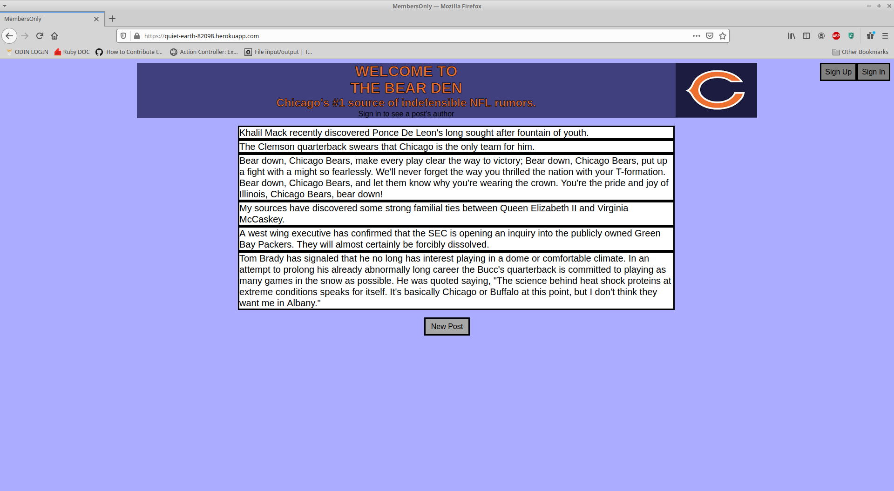
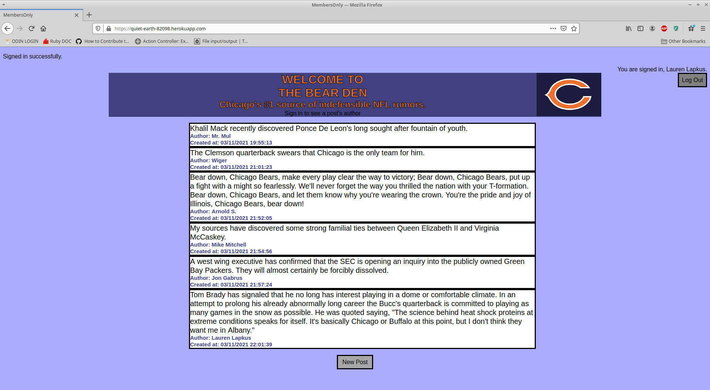
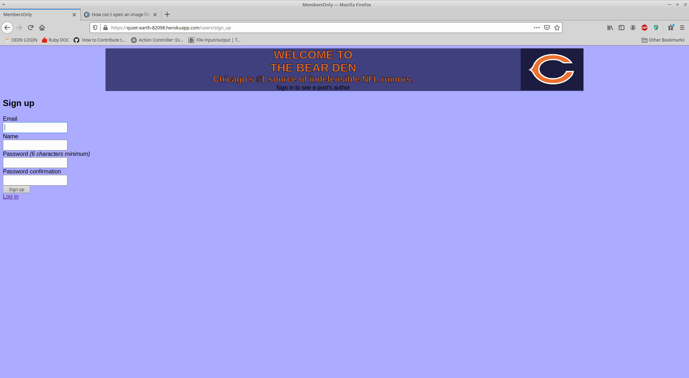

# Members Only

## Overview

This project primarily involves the use of devise of authenticate users limit site access to authorized areas.
It was created for The Odin Project's "Project: Authentication" featured here: https://www.theodinproject.com/courses/ruby-on-rails/lessons/authentication
***
## Live Demo

You can try it out [here](https://quiet-earth-82098.herokuapp.com/)  
Heroku is (in this case) a complimentary service and it may take up to thirty seconds to start a dyno. 
___Thank you for your patience.___

Sign up using a fake e-mail and password to see the creator of a post, as well as its post date.
(DO NOT USE ANY VALID INFORMATION, EMAILS ARE NOT AUTHENTICATED)

## Screenshots 






***
## Installation 

Clone the repo to your local machine: 
```ruby
$ git clone https://github.com/Kojack8/members_only.git
```
Install the needed gems:
```ruby
$ bundle install
```
Install webpacker:
```
$ rails webpacker:install
```
Migrate the database:
```ruby
$ rails db:migrate
```
Finally, on root path run a local server:
```ruby
$ rails s
```
Open browser to view application:
```ruby
localhost:3000
```

